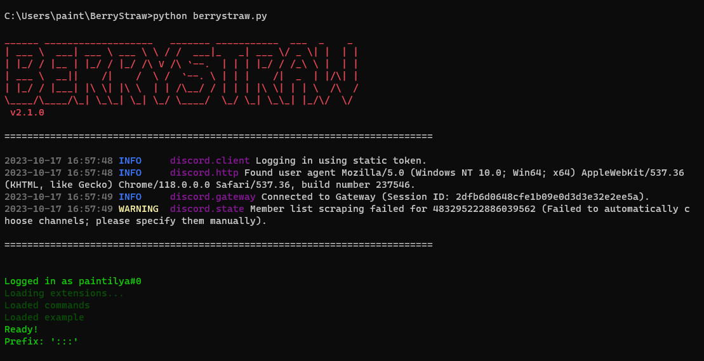

## About
BerryStraw is a self-bot python tool that gives you access to multiple commands to make your discord experience a little more fun and easy.

## Current features
- (st) Switch theme: toggle between light and dark theme.

## Requirements
`Python 3.10 or higher`

### Will be installed automatically
- `colorama==0.4.6`
- `discord.py==2.3.2`
- `python-dotenv==1.0.0`
- `Requests==2.31.0`

## Installation & Usage
1. Clone this repository.
2. Create a `.env` file with this inside:
    ```
    USER_TOKEN={INSERT}
    PREFIX={INSERT}
    ```
3. Run `python berrystraw.py` from the current working directory.